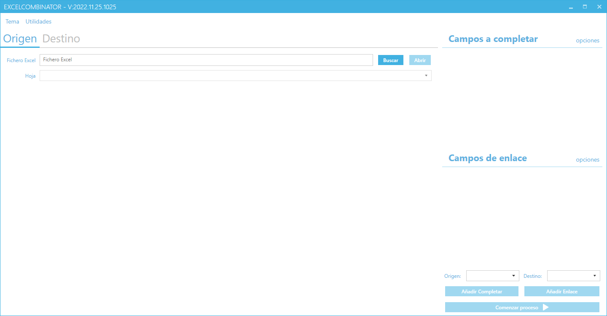
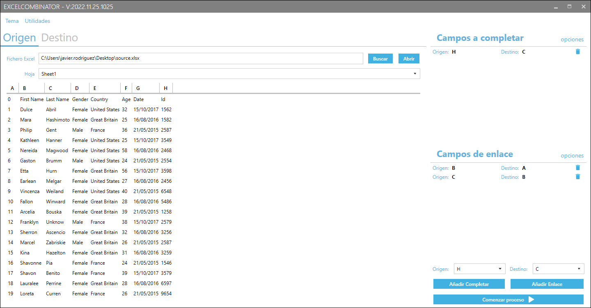
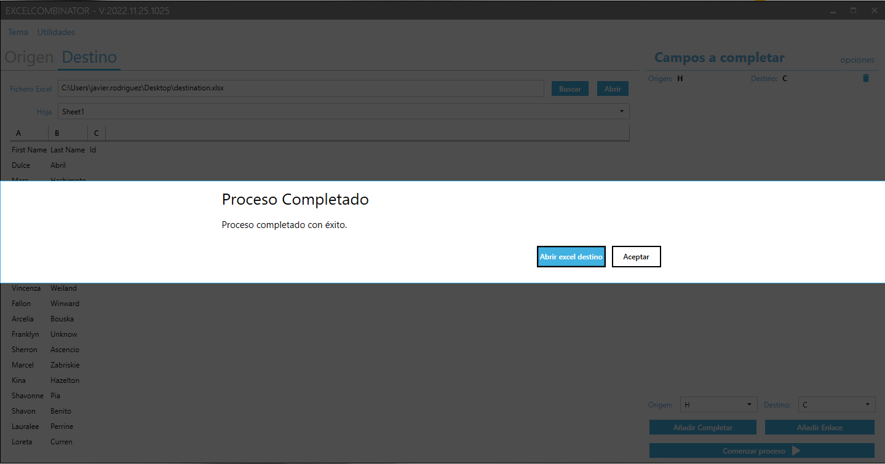

# Excel files combinator app

## Descripción

Este programa permite combinar vdatos de dos ficheros de Excel en uno solo. Para ello, se establecen los campos de enlace entre ambos ficheros y los campos que se desean combinar. Si una fila del fichero de origen tiene los mismos valores en los campos de enlace que una fila del fichero de destino, se copiarán los valores de los campos a combinar de la fila del fichero de origen a la fila del fichero de destino.

## Instalación

Para instalar el programa, descargue el fichero comprimido desde la sección de [releases](https://github.com/jjavierrg/CombinadorExcel/releases/latest) y descomprímalo en la carpeta que desee.

## Uso

Una vez descargado y descomprimido el fichero, ejecute el fichero `ExcelCombinator.exe`.

Aparecerá una ventana como la siguiente:

En la pestaña 'Origen' seleccione el fichero de Excel que contiene los datos que desea combinar. En la pestaña 'Destino' seleccione el fichero de Excel en el que desea combinar los datos. Tenga en cuenta que al fichero de destino se le incorparán los datos del fichero de origen cuyos valores de los campos de enlace establecidos coincidan.

Después de seleccionar los ficheros de origen y destino, seleccione las hojas de ambos ficheros que contienen los datos que desea combinar. El programa mostrará una vista previa de los datos que contiene cada hoja. Tenga en cuenta que el programa sólo permite combinar datos de una hoja de cada fichero.

### Campos a completar

En la sección 'Campos a completar' se establecen las columnas que se desean combinar. Para ello, seleccione en el desplegable 'Origen' la columna del fichero de origen del que se leerán los datos y en el desplegable 'Destino' la columna del fichero de destino en la que se escribirán los datos. Pulse el botón 'Añadir Completar' para añadir la relación entre ambas columnas. Repita este proceso para todas las columnas que desee combinar.

Si una fila del fichero de origen tiene los mismos valores en los campos de enlace que una fila del fichero de destino, se copiarán los valores de los campos a combinar de la fila del fichero de origen a la fila del fichero de destino. En caso de que una de las columnas a combinar no tenga valor en la fila del fichero de origen, se mantendrá por defecto el valor de la fila del fichero de destino. Si desea que se borre el valor de la fila del fichero de destino en caso de que no haya valor en la fila del fichero de origen, seleccione la opción 'Traspasar valores nulos si hay coincidencia' dentro de la pestaña 'opciones' de la sección campos a completar.

### Campos de enlace

En la sección 'Campos de enlace' se establecen las columnas que se utilizarán para enlazar los datos de ambos ficheros y determinar las filas coincidentes en cada hoja. Para ello, seleccione en el desplegable 'Origen' la columna del fichero de origen del que se leerán los datos y en el desplegable 'Destino' la columna del fichero de destino con la que se van a verificar los datos. Pulse el botón 'Añadir Enlace' para añadir la relación entre ambas columnas. Repita este proceso para todas las columnas que desee utilizar para enlazar los datos.

Por defecto, el programa obliga a que se cumplan todas las condiciones de enlace para que se considere que una fila del fichero de origen y una fila del fichero de destino son coincidentes. Si desea que se ambas filas se consideren coincidentes si se cumple alguna de las condiciones de enlace, desmarque la opción 'Requerir todos los campos' dentro de la pestaña 'opciones' de la sección campos de enlace.

Además, puede establecer que se ignoren las mayúsculas, minúsculas y acentos en los campos de enlace. Para ello, marque la opción 'Normalizar valores de campos' dentro de la pestaña 'opciones' de la sección campos de enlace.

### Ejecución

Una vez seleccionados los ficheros de origen destino y establecidos los campos de enlace y los campos a completar, pulse el botón 'Comenzar proceso' para combinar los datos de ambos ficheros. El programa mostrará un aviso cuando haya terminado el proceso. Una vez finalizado, el fichero de destino se habrá completado con los datos del fichero de origen en aquellas filas que cumplan las condiciones establecidas en los campos de enlace. Puede abrir el fichero de destino para comprobar que los datos se han combinado correctamente pulsando el botón 'Abrir excel destino'. que aparece en la ventana de aviso.

## Actualización

El programa se actualizará automáticamente cuando se publique una nueva versión. Para ello, el programa comprueba periódicamente si hay una nueva versión disponible. Si la hay, se descargará y se instalará automáticamente.

## Soporte

Si tienes alguna pregunta o problema, puedes abrir un [issue](https://github.com/jjavierrg/CombinadorExcel/issues) en este repositorio.

## Licencia

Este proyecto está licenciado bajo la Licencia Apache 2.0. Consulta el archivo [LICENSE](LICENSE) para obtener más información.
